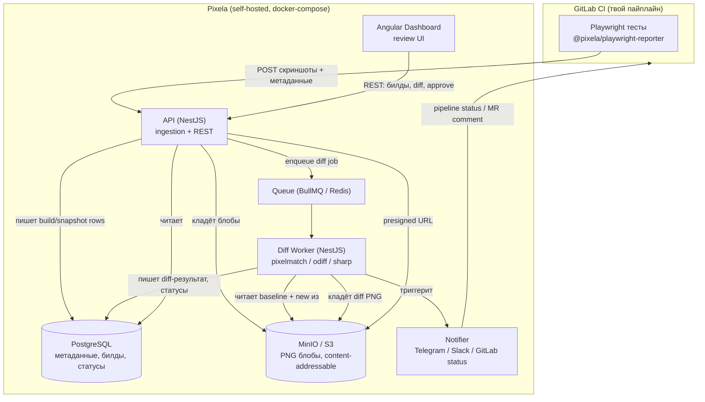
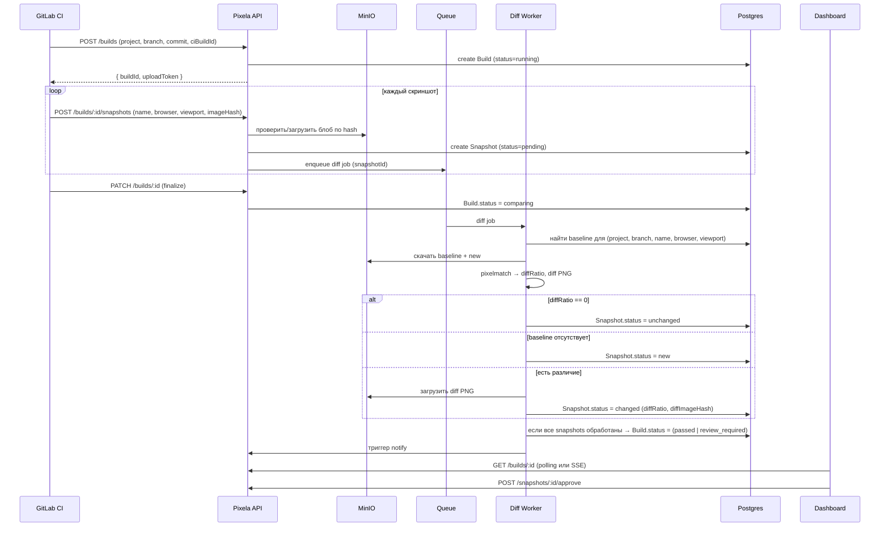

# 02 — Architecture

## Компоненты (высокоуровнево)



## Поток данных: жизненный цикл билда



## Сервисы в docker-compose

| Сервис | Образ/основа | Роль | Порт (внутр.) |
|--------|--------------|------|---------------|
| `pixela-api` | node (NestJS) | HTTP API + ingestion | 3000 |
| `pixela-worker` | node (NestJS) | diff jobs consumer | — |
| `pixela-web` | node→static (Angular) или nginx | дашборд | 80 |
| `postgres` | postgres:16 | БД | 5432 |
| `redis` | redis:7 | очередь BullMQ | 6379 |
| `minio` | minio/minio | S3-совместимое хранилище | 9000/9001 |
| `traefik` | traefik | reverse-proxy + TLS | 80/443 |

API и worker — один и тот же кодовый модуль, запускаемый в двух режимах (`API_MODE=http` / `API_MODE=worker`).
Это упрощает деплой и переиспользование Prisma-клиента и сервисов.

## Почему async diff (а не синхронно в запросе)

Билд может содержать сотни скриншотов. Синхронное сравнение в HTTP-хендлере: (1) держит соединение
минутами, (2) не масштабируется горизонтально, (3) падает по таймауту. Очередь BullMQ позволяет:
параллелить воркеры, ретраить упавшие jobs, изолировать тяжёлую CPU-работу (pixelmatch/sharp) от API.

## Границы модулей (NestJS feature modules)

```
src/
├── main.ts                  # bootstrap, переключение http/worker по env
├── app.module.ts
├── projects/                # CRUD проектов, API-ключи
├── builds/                  # создание/финализация билдов, агрегатный статус
├── snapshots/               # приём скриншотов, статусы, approve/reject
├── storage/                 # абстракция S3/MinIO, CAS по sha256, presigned URLs
├── diff/                    # diff engine, очередь, воркер-процессор
├── baseline/                # резолв baseline (git-native), история версий
├── notifications/           # Telegram, Slack, GitLab status/comment
├── auth/                    # API-ключи (для CI) + сессии/OAuth (для дашборда)
└── common/                  # DTO, guards, фильтры, утилиты
```

## Ключевые технические инварианты (повтор из CLAUDE.md)

- Блобы в S3, метаданные в Postgres. Никогда не наоборот.
- Ingestion stateless; diff async.
- CAS: один и тот же PNG хранится один раз (ключ = sha256 содержимого).
- Каждый внешний запрос проходит guard аутентификации (API-ключ или сессия).
