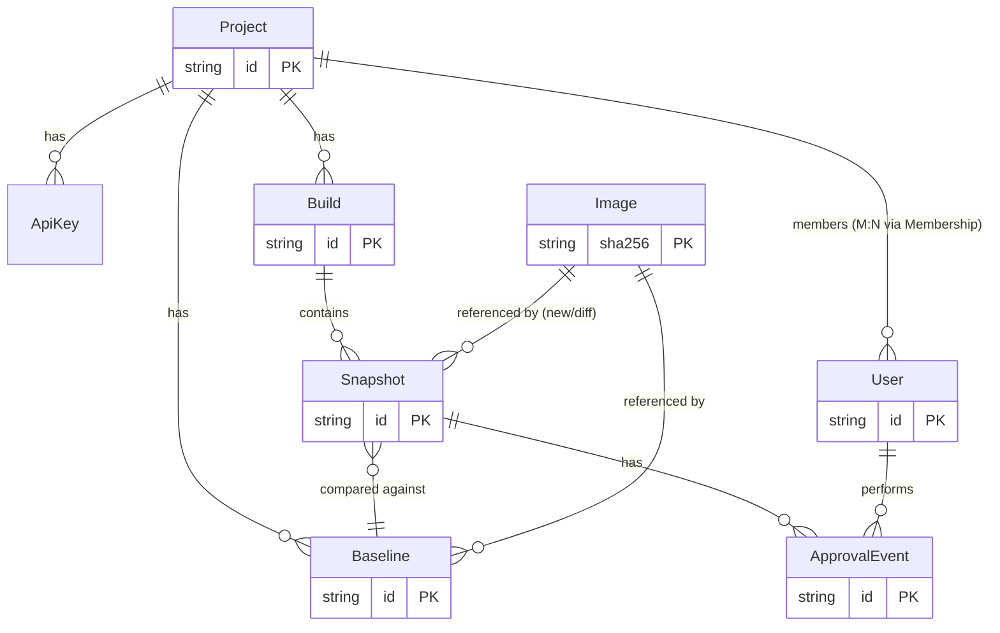

# 03 — Data Model

> ORM: **Prisma**. БД: **PostgreSQL**. Это контракт схемы. Миграции необратимы в проде — менять с осторожностью.

## Сущности и связи



## Prisma schema (целевой `schema.prisma`)

```prisma
// Картинка хранится один раз по хэшу содержимого (content-addressable).
// Сам байт-контент — в S3/MinIO по ключу = sha256. Здесь только метаданные.
model Image {
  sha256    String   @id            // ключ в S3 и первичный ключ
  width     Int
  height    Int
  byteSize  Int
  createdAt DateTime @default(now())

  snapshotsAsNew   Snapshot[] @relation("SnapshotNewImage")
  snapshotsAsDiff  Snapshot[] @relation("SnapshotDiffImage")
  baselines        Baseline[]
}

model Project {
  id          String   @id @default(cuid())
  name        String
  slug        String   @unique
  // Референсная ветка проекта (обычно "main"/"master") — для UI и дефолтов.
  defaultBranch String @default("main")
  createdAt   DateTime @default(now())

  apiKeys     ApiKey[]
  builds      Build[]
  baselines   Baseline[]
  memberships Membership[]
}

model ApiKey {
  id         String   @id @default(cuid())
  projectId  String
  project    Project  @relation(fields: [projectId], references: [id], onDelete: Cascade)
  // Хранить ХЭШ ключа, не сам ключ. Показываем ключ один раз при создании.
  keyHash    String   @unique
  name       String
  createdAt  DateTime @default(now())
  lastUsedAt DateTime?
}

model Build {
  id          String      @id @default(cuid())
  projectId   String
  project     Project     @relation(fields: [projectId], references: [id], onDelete: Cascade)
  branch      String
  commitSha   String
  // ID джобы/пайплайна CI — связывает билд с конкретным прогоном.
  ciBuildId   String?
  ciJobUrl    String?
  // Для статуса в MR.
  mrIid       String?      // GitLab merge request iid
  status      BuildStatus  @default(RUNNING)
  createdAt   DateTime     @default(now())
  finalizedAt DateTime?

  snapshots   Snapshot[]

  @@index([projectId, branch, createdAt])
  @@index([projectId, commitSha])
}

enum BuildStatus {
  RUNNING          // принимаем скриншоты
  COMPARING        // финализирован, идёт diff
  PASSED           // все unchanged (или все изменения уже approved)
  REVIEW_REQUIRED  // есть changed/new, нужно ревью
  REJECTED         // ревьюер отклонил
  ERROR            // сбой обработки
}

model Snapshot {
  id          String         @id @default(cuid())
  buildId     String
  build       Build          @relation(fields: [buildId], references: [id], onDelete: Cascade)

  // Идентичность снапшота — стабильный ключ для сопоставления с baseline.
  name        String         // напр. "events-list--desktop"
  browser     String         // "chromium" | "firefox" | "webkit"
  viewport    String         // "1280x720"

  // Снятое в этом прогоне изображение.
  newImageSha String?
  newImage    Image?         @relation("SnapshotNewImage", fields: [newImageSha], references: [sha256])

  // Diff-изображение (если было различие).
  diffImageSha String?
  diffImage    Image?        @relation("SnapshotDiffImage", fields: [diffImageSha], references: [sha256])

  // С каким baseline сравнивали (может быть null если new).
  baselineId  String?
  baseline    Baseline?      @relation(fields: [baselineId], references: [id])

  diffRatio   Float?         // доля изменённых пикселей [0..1]
  diffPixels  Int?
  status      SnapshotStatus @default(PENDING)
  errorMsg    String?
  createdAt   DateTime       @default(now())

  approvals   ApprovalEvent[]

  // Один и тот же логический скриншот уникален в рамках билда.
  @@unique([buildId, name, browser, viewport])
  @@index([status])
}

enum SnapshotStatus {
  PENDING    // в очереди на diff
  UNCHANGED  // diffRatio == 0 (в пределах порога)
  CHANGED    // есть различие, ждёт решения
  NEW        // baseline отсутствовал
  REMOVED    // был в baseline, нет в этом билде (вычисляется на финализации)
  APPROVED   // изменение принято ревьюером
  REJECTED   // изменение отклонено
  ERROR
}

// Принятый эталон. Идентичность: project + branch + name + browser + viewport.
// Хранит ссылку на Image. История — через несколько строк Baseline во времени
// ИЛИ через отдельную таблицу версий (см. ниже). MVP: текущий baseline + лента ApprovalEvent.
model Baseline {
  id         String   @id @default(cuid())
  projectId  String
  project    Project  @relation(fields: [projectId], references: [id], onDelete: Cascade)
  branch     String
  name       String
  browser    String
  viewport   String

  imageSha   String
  image      Image    @relation(fields: [imageSha], references: [sha256])

  // Кто и в каком билде утвердил этот baseline.
  approvedByUserId String?
  approvedInBuildId String?
  updatedAt  DateTime @updatedAt
  createdAt  DateTime @default(now())

  snapshots  Snapshot[]

  // Один активный baseline на (проект, ветка, имя, браузер, viewport).
  @@unique([projectId, branch, name, browser, viewport])
}

model ApprovalEvent {
  id         String        @id @default(cuid())
  snapshotId String
  snapshot   Snapshot      @relation(fields: [snapshotId], references: [id], onDelete: Cascade)
  userId     String
  user       User          @relation(fields: [userId], references: [id])
  action     ApprovalAction
  createdAt  DateTime      @default(now())
}

enum ApprovalAction { APPROVE REJECT }

model User {
  id          String   @id @default(cuid())
  email       String   @unique
  name        String?
  // Локальный пароль (хэш) ИЛИ внешний провайдер (GitLab OAuth).
  passwordHash String?
  gitlabId    String?  @unique
  createdAt   DateTime @default(now())

  memberships  Membership[]
  approvals    ApprovalEvent[]
}

model Membership {
  id        String   @id @default(cuid())
  userId    String
  user      User     @relation(fields: [userId], references: [id], onDelete: Cascade)
  projectId String
  project   Project  @relation(fields: [projectId], references: [id], onDelete: Cascade)
  role      Role     @default(MEMBER)

  @@unique([userId, projectId])
}

enum Role { OWNER MEMBER }
```

## Заметки по решениям

- **Content-addressable `Image`.** Если 480 из 500 скриншотов не изменились, их `newImageSha` будет
  равен sha существующих baseline-картинок — блоб в S3 не дублируется. Огромная экономия места и трафика.
- **`@@unique([buildId, name, browser, viewport])`** гарантирует, что повторная заливка того же скриншота
  в билд (ретрай в CI) не плодит дубли — используем upsert.
- **История версий.** MVP обходится текущим `Baseline` + лентой `ApprovalEvent` (кто/когда/что). Если нужна
  полная лента «как менялся скриншот», можно (а) не удалять старые `Image` и собирать историю через билды,
  либо (б) добавить таблицу `BaselineVersion`. Не делай (б) в MVP — добавишь, если реально понадобится.
- **`REMOVED`** вычисляется на финализации билда: baseline для (ветка, имя, browser, viewport) есть, а
  снапшота с таким ключом в билде нет. Это сигнал «скриншот пропал» (удалили тест или баг).
- **Хэш API-ключа**, а не сам ключ. Сырой ключ показываем один раз при создании и больше никогда.

## Открытый вопрос для brainstorm

Нужна ли отдельная таблица `BaselineVersion` для полной истории, или ленты `ApprovalEvent` + сохранения
старых `Image` достаточно? См. `prompts/02-brainstorm-prompts.md`. По умолчанию — НЕ добавляем (YAGNI).
