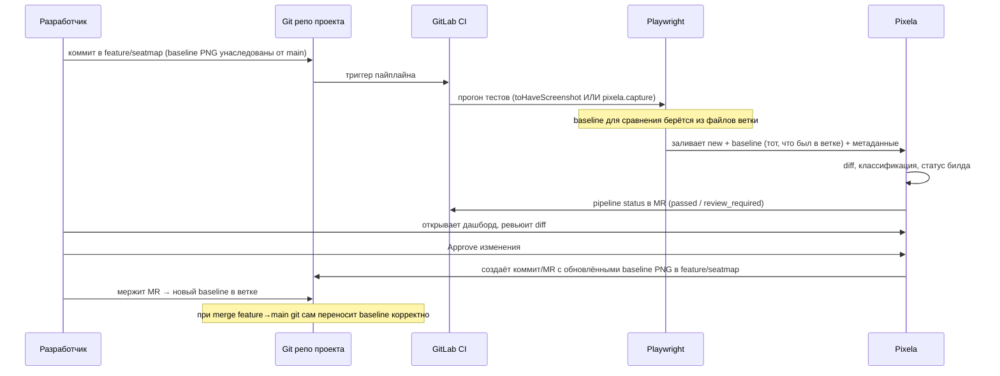

# 06 — Baseline Strategy (ядро архитектуры)

> Это самый важный спек-файл. Здесь объясняется, почему baseline решается через git, а не на сервере.
> Claude Code: если задача когда-либо подталкивает к серверному merge-base resolution — остановись и сверься здесь.

## Модель по умолчанию: Git-Native Baseline

### Принцип

Baseline-скриншоты — это **файлы в git-репозитории тестируемого проекта**, ровно как нативные
Playwright-снапшоты в `__screenshots__/`. Pixela НЕ хранит «истинный baseline для ветки» на сервере как
источник правды для сравнения веток. Pixela хранит:

- **Image-блобы** (для отображения и diff) — в своём S3;
- **запись `Baseline`** (для UI-истории и быстрого сравнения внутри прогона) — в своей БД;

но **канонический baseline, против которого идёт сравнение, определяется тем, что лежит в git** на коммите,
который тестируется. Это значит:

- На ветке `feature/seatmap` тесты сравниваются с baseline-PNG, **которые есть в этой ветке** (они
  унаследованы от точки ответвления от `main` через сам git).
- Когда ветка делает rebase / merge / squash — git сам приводит baseline-файлы в корректное состояние.
- «Approve» в дашборде → Pixela готовит **коммит/MR с обновлёнными PNG** в репозиторий проекта. После
  мержа этого коммита новый baseline становится частью ветки автоматически.

### Почему это правильно (и почему серверная модель — ловушка)

Серверная модель (как в Argos) обязана отвечать на вопрос: «для билда на коммите `c3` ветки `feature/x` —
какой baseline взять?» Правильный ответ требует: найти merge-base между `c3` и `main`, найти последний
**approved** билд на коммите-предке, взять его скриншоты. А теперь реальность ломает это так:

1. **Параллельные прогоны** на одной ветке — гонка за «последний approved».
2. **Force-push / rebase** переписывают SHA — предыдущие билды «повисают» на несуществующих коммитах.
3. **Первый билд на ветке** — нет предка с апрувом вообще.
4. **Squash-merge** схлопывает историю — merge-base указывает не туда, куда ожидаешь.
5. **Per-screenshot approval** — «approved» это статус отдельного скриншота, не билда целиком.

Каждый случай при неверной обработке даёт либо ложный шум «new», либо ложное «unchanged». Их находят
медленно, в проде, и это месяц+ работы и бесконечный хвост багов. **AI генерирует здесь правдоподобный, но
тонко неверный код**, потому что канонической реализации в обучающих данных нет — каждый делает по-своему.

Git-native модель **делегирует всю эту сложность git'у**, который решает её корректно и бесплатно: merge,
rebase, squash, ответвление — это ровно то, для чего git создан. Мы не переписываем git хуже git.

## Как это работает в потоке (детально)

### Два под-режима git-native (выбери при постройке)

**Режим A — Playwright владеет baseline-файлами (рекомендуется).**
Тесты используют нативный `toHaveScreenshot()`. Baseline-PNG лежат в репо. Pixela-reporter дополнительно
заливает в Pixela `new`, `baseline` (прочитанный из файла) и diff — **для красивого ревью и истории**.
«Approve» в Pixela = `git` коммит обновлённых снапшот-файлов (Pixela готовит patch/MR через GitLab API
или отдаёт CLI-команду). Diff можно считать и локально (Playwright), и на сервере (для единообразия UI).

> Плюс: baseline всегда консистентен с веткой через git. Pixela — слой ревью поверх, не источник правды.

**Режим B — Pixela хранит baseline, но синхронизирует с git.**
Тесты вызывают `pixela.capture()` (не пишут файлы). Pixela сравнивает с `Baseline` из своей БД для текущей
ветки. Approve обновляет `Baseline` в БД И коммитит снапшот в git (для воспроизводимости/портируемости).
Сложнее, ближе к Argos, но всё ещё избегает merge-base (сравниваем строго в пределах ветки).

> Выбор: начинай с **Режима A**. Он проще, надёжнее и не дублирует источник правды. Режим B — если
> команде неудобно держать PNG в git и нужен полностью серверный workflow.

## Сравнение в пределах ветки (без merge-base)

Ключевое упрощение, которое делает обе модели безопасными: **Pixela никогда не сравнивает ветки между
собой.** Сравнение всегда: `new скриншот` vs `baseline той же ветки`. Откуда взялся baseline ветки — забота
git (он унаследован от родителя при ответвлении). Это убирает весь класс merge-base багов.

- Новая ветка от `main` → baseline-файлы унаследованы → первое сравнение осмысленно.
- Изменение на ветке → diff показывает только то, что изменила ветка.
- Merge в `main` → git переносит обновлённые baseline → на `main` они уже актуальны.

## Approve → Git (механика F-32)

При approve Pixela должна привести baseline-файлы в репо к новому состоянию. Варианты реализации (по
возрастанию автоматизации):

1. **CLI-команда** (MVP-минимум): дашборд показывает `pixela pull-baseline --build <id>`, которая скачивает
   approved-картинки и кладёт в нужные пути снапшотов; разработчик коммитит сам. Просто, надёжно.
2. **Commit через GitLab API**: Pixela сам создаёт коммит с обновлёнными PNG в ветку (Commits API,
   несколько файлов в одном коммите). Требует токен с правом записи.
3. **Отдельный MR**: Pixela создаёт ветку `pixela/update-baseline-<build>` + MR. Безопаснее (ревью самого
   обновления), но больше движущихся частей.

> MVP: реализуй (1) гарантированно, (2) — если есть токен и время. (3) — пост-MVP.

## Server-side mode (NOT recommended — читать только если очень нужно)

Если ты сознательно решаешь делать полный серверный baseline-resolution (merge-base), знай, на что
подписываешься, и реализуй ОТДЕЛЬНЫМ модулем с явными тестами на ВСЕ краевые случаи:

- интеграция с GitLab API для получения merge-base (`/repository/merge_base`);
- обработка force-push (инвалидация билдов на переписанных SHA);
- семантика «approved» на уровне билда vs скриншота;
- блокировки/идемпотентность при параллельных прогонах;
- поведение при отсутствии предка (первый билд ветки) и при squash.

Каждый пункт — отдельный тест-кейс. Без полного покрытия этот режим будет тихо врать. По умолчанию **мы
его не строим** и в `05-features.md` он помечен `W-01`.
